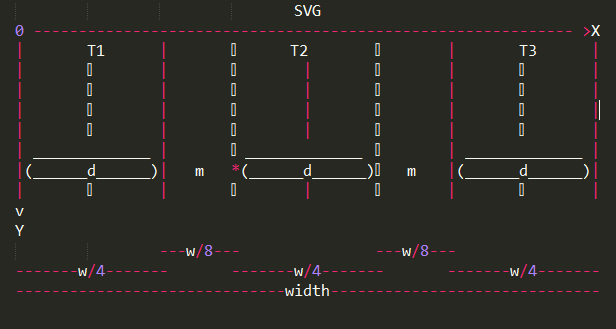

# Mô hình hóa thuật toán Tháp Hà Nội (Hanoi Towers) bằng D3JS - Hướng đối tượng


## Phân tích bài toán theo Logic  
#### Sử dụng thuật toán Đệ Quy để giải quyết bài toán:  
```javascript
var hanoi = function(disc,src,aux,dest){
  if(disc > 0){
    hanoi(disc -1,src,dest,aux);
    console.log('Move disc '+disc+' from '+src+' to '+dest);
    hanoi(disc -1,aux,src,dest);
  }
};
hanoi(3,'src','aux','dest');
```
#### Trong đó:    
* src,aux,dest là các Tháp tương ứng: Tháp gốc (src),Tháp trung gian(aux) và Tháp Đích.
* disk là tham số dạng Number tương ứng số đĩa truyền vào.
#### Cách giải  
* Chuyển n-1 đĩa từ cọc A sang B. Chỉ còn đĩa n trên cọc A.  
* Chuyển đĩa n từ cọc A sang cọc C.  
* Chuyển n-1 đĩa từ B sang C cho các đĩa có đường kính nhỏ hơn lần lượt nằm trên đĩa n.  
* Tiến hành bước 1 và 3, áp dụng lại thuật giải cho n-1.  

## Các Bước xây dựng:
#### Bước 1: Vẽ svg Tổng và tính toán tọa độ các cọc,đĩa  

* Sử dụng thư viện d3js để vẽ svg:  

``` javascript
let w = $(".container").width()
let h = 300
let svg = d3.select(".container")
			.append("svg")
			.attr("width", w)
			.attr("height",h + disks_input*40); 
			//với n là số đĩa đưa vào ở sau,40 là chiều cao từng đĩa.
```

* Tính toán tọa độ,khoảng cách giữa các cọc,đĩa:
	> - Đầu tiên,ta chia svg ra làm 4 phần theo chiều dọc,tức là width/4  
	> - Rồi chia tiếp mỗi phần đó làm đôi theo chiều dọc,tức là width/8  
	> - Ta sẽ thấy từ hình dưới,ta tạo được 3 đĩa có bán kính bằng nhau và cách nhau 1 khoảng bằng w/8 và mỗi đĩa có bán kính bằng w/4,khoảng margin(m) giữa các đĩa bằng w/8
	> - Ta định nghĩa các thuộc tính của đĩa và cọc:
```javascript
	//đĩa ở cuối sẽ có bán kính lớn nhất nên ta đặt nó bằng w/4 (d)
	let biggest_disk = w/4; 

	// đây là vị trí tower2 với dấu '*' trên hình -> tower1 có x=0,tower3 có x=2*margin
	let margin = biggest_disk + biggest_disk/2;
	//tower1 = 0
	//tower2 = margin
	//tower3 = 2 * margin
```


##### Bước 2: Khởi tạo các biến global:

```javascript
	let svg , unit_disk , disks_input = total_disks = '', tower_height, checkpoint, timesound;
	let disks_in_tower1=disks_in_tower2=disks_in_tower3= '';
	let biggest_disk = $(".container").width()/4; //khai báo bán kính đĩa cuối cùng cũng là đĩa lớn nhất
	let margin = biggest_disk + biggest_disk/2;   
	let arr_disk = [], courier = [];		//tạo mảng chứa disk và courier
	let i = 1, steps = click = delay_disk = delay_courier = 0;
```
##### Bước 3: Khai báo class và phương thức:

* Class Disk và các phương thức:

```javascript
class Disk {
	build_disk(){
	unit_disk = biggest_disk/disks_input; // Chiều rộng của đĩa nhỏ nhất

	//Tạo và vẽ đĩa
	for (var i = 1; i<=disks_input; i++){ // Vẽ đĩa vào thẻ svg đã tạo
		svg.append("rect")
		.attr("x", function(){ // Tọa độ x của đĩa so với thẻ svg
			//mỗi lần lặp,ta sẽ rút ngắn bán kính của đĩa tùy theo số lượng đĩa.
			return (disks_input-i)*(unit_disk/2); 
		})
		.attr("y", function(){ // Tọa độ y của đĩa so với thẻ svg
			return i*40+150;
		})
		.attr("width", function(){ // Chiều rộng của từng đĩa
			return i*unit_disk;
		})
		.attr("height",40) // Chiều cao của từng đĩa
		.attr("rx",10) // Bo góc của từng đĩa
		.attr("ry",10) // Bo góc của từng đĩa
		.attr("stroke-width", 1) // Độ dày viền border của đĩa
		.attr("stroke", "rgba(0,0,0,.5)") // Màu viền
		.classed("disk" + i + " color", true); // Gán class cho từng đĩa

		arr_disk.push(d3.select(".disk" + i)); // Chuyển đĩa vào mảng đã khởi tạo ban đầu
	}

		//Tạo và vẽ chim
		svg.append("svg:image") // Thêm ảnh vào thẻ svg
		.attr("xlink:href", "giphy-right.gif") // Đường dẫn ảnh
		.attr("x", (biggest_disk-100)/2) // Tọa độ x của ảnh trong thẻ svg
		.attr("y", 129) // Tọa độ y của ảnh trong thẻ svg
		.attr("width", 100) // Chiều rộng của ảnh trong thẻ svg
		.attr("height", 60); // Chiều cao của ảnh trong thẻ svg
		courier.push(d3.select("image")); // Chuyển ảnh vào mảng đã khởi tạo ban đầu

		d3.selectAll(".color").style("fill", function() { // Tạo màu cho từng đĩa Random
			return "hsl(" + Math.random() * 360 + ",100%,50%)";
		});
	}
}
```
* Khai báo class Tower và phương thức:

```javascript
class Tower {
	build_tower(){
	for (var j=0; j<3; j++){ // Dựng đế cho tower
		svg.append("rect")
		.attr("x", function(){
			//j=0,1,2*margin tương ứng tọa độ bắt đầu của tower1,2,3 như đã giải thích ở trên
			return j*margin; 
		})
		.attr("y", disks_input*40+190) //h
		.attr("rx", 10)
		.attr("ry", 10)
		.attr("width", biggest_disk) //bán kính đĩa lớn nhất
		.attr("height", 10)
		.attr("fill", "rgba(105, 105, 105, 0.8)");
		}
	}
}
```
* Khai báo class GameEngine và phương thức:

```javascript
class GameEngine {
		move(n, tower1, tower2, tower3){
			if (n > 0) {
				this.move(n-1, tower1, tower3, tower2);
				let newX_disk = tower3+(total_disks-n)*(unit_disk/2); // Tọa độ x mới của đĩa
				let newY_disk = '', start_ycourier = ''; // Tõa độ y mới của đĩa và courier
				let Gocourier = '', Backcourier = ''; // Chiều đi và chiều về của courier
				let Goimg = "giphy-right.gif", Backimg = "giphy-left.gif"; // Ảnh đi và ảnh về

				//kiểm tra xem đĩa cần chuyển có phải từ tower1 -> tower2 
				if (tower1 == 0 && tower3 == margin){

					//gán hướng đi cho chim,Goimg là đi xuôi,Backimg là đi ngược
					Gocourier = Goimg; Backcourier = Backimg;

					//gán y ban đầu cho courier
					start_ycourier = tower_height - disks_in_tower1*40+190;

					//gán y đích mới cho đĩa
					newY_disk = tower_height - disks_in_tower2*40+150;

					//sau khi chuyển đĩa thì giảm đĩa ở fromTower và toTower
					disks_in_tower1--; disks_in_tower2++; 
					console.log("disks_in_tower1 " + disks_in_tower1 + ", disks_in_tower2 " + disks_in_tower2);
				}

				//Kiểm tra xem đĩa cần chuyển có phải từ tower1 -> tower3
				if (tower1 == 0 && tower3 == 2*margin){
					Gocourier = Goimg; Backcourier = Backimg;
					start_ycourier = tower_height - disks_in_tower1*40+190;
					newY_disk = tower_height - disks_in_tower3*40+150;
					disks_in_tower1--; disks_in_tower3++;
					console.log("disks_in_tower1 " + disks_in_tower1 + ", disks_in_tower3 " + disks_in_tower3);
				}

				//kiểm tra xem đĩa cần chuyển có phải từ tower2 -> tower1
				if (tower1 == margin && tower3 == 0){
					Gocourier = Backimg; 

					//checkpoint được gán bằng tọa độ của toTower 
					//kiểm tra xem nếu tọa độ của chim hiện tại(toTower) nhỏ hơn tọa độ tower1,2,3 
					//thì gán courier di chuyển ngược,còn lại là xuôi
					if (checkpoint < margin) { 
						Backcourier = Goimg; //đi ngược
					}
					else{
						Backcourier = Backimg; //đi xuôi
					}
					
					start_ycourier = tower_height - disks_in_tower2*40+190;
					newY_disk = tower_height - disks_in_tower1*40+150;
					disks_in_tower2--; disks_in_tower1++;
					console.log("disks_in_tower1 " + disks_in_tower1 + ", disks_in_tower2 " + disks_in_tower2);
				}

				//kiểm tra xem đĩa cần chuyển có phải từ tower2 -> tower3
				if (tower1 == margin && tower3 == 2*margin){
					Gocourier = Goimg;
					if (checkpoint > margin) {
						Backcourier = Backimg;
					}
					else{
						Backcourier = Goimg;
					}

					start_ycourier = tower_height - disks_in_tower2*40+190;
					newY_disk = tower_height - disks_in_tower3*40+150;
					disks_in_tower2--; disks_in_tower3++;
					console.log("disks_in_tower2 " + disks_in_tower2 + ", disks_in_tower3 " + disks_in_tower3);
				}

				//kiểm tra xem đĩa cần chuyển có phải từ tower3 -> tower2 
				if (tower1 == 2*margin && tower3 == margin){
					Gocourier = Backimg; Backcourier = Goimg;
					start_ycourier = tower_height - disks_in_tower3*40+190;
					newY_disk = tower_height - disks_in_tower2*40+150;
					disks_in_tower2++; disks_in_tower3--;
					console.log("disks_in_tower2 " + disks_in_tower2 + ", disks_in_tower3 " + disks_in_tower3);
				}

				//kiểm tra xem đĩa cần chuyển có phải từ tower3 -> tower1
				if (tower1 == 2*margin && tower3 == 0){
					Gocourier = Backimg; Backcourier = Goimg;
					start_ycourier = tower_height - disks_in_tower3*40+190;
					newY_disk = tower_height - disks_in_tower1*40+150;
					disks_in_tower1++; disks_in_tower3--;
					console.log("disks_in_tower1 " + disks_in_tower1 + ", disks_in_tower3 " + disks_in_tower3);
				}

				//kiểm tra delay để cho chim chạy cùng disk khi nhấc và chạy trước disk khi quay lại
				if (delay_disk != 0){
					if (delay_courier == 0) {
						courier[0]
						.transition()
						.delay(2250)
						.attr("xlink:href", Backcourier)
						.duration(750)
						.attr("y", 0)
						.transition()
						.duration(750)
						.attr("x", tower1+92.5)
						.transition()
						.duration(750)
						.attr("y", start_ycourier-62);
						delay_courier++;
					}
					else{
						courier[0]
						.transition()
						.delay(delay_courier*4500 + 2250)
						.attr("xlink:href", Backcourier)
						.duration(750)
						.attr("y", -1)
						.transition()
						.duration(750)
						.attr("x", tower1+92.5)
						.transition()
						.duration(750)
						.attr("y", start_ycourier-62);
						delay_courier++;
					}
				}

				//d3js để animation courier
				courier[0]
				.transition()
				.delay(delay_disk*4500)
				.attr("xlink:href", Gocourier)
				.duration(750)
				.attr("y", -1)
				.transition()
				.duration(750)
				.attr("x", tower3+92.5) // tower3 + 92.5
				.transition()
				.duration(750)
				.attr("y", newY_disk - 62);

				//d3js để animation disk
				arr_disk[n-1]
				.transition()
				.delay(delay_disk*4500)
				.duration(750)
				.attr("y", 60)
				.transition()
				.duration(750)
				.attr("x", newX_disk)
				.transition()
				.duration(750)
				.attr("y", newY_disk);

				delay_disk++; //delay sau mỗi lần lặp
				checkpoint = tower3; //gán checkpoint của courier cho toTower
				console.log(checkpoint);

				console.log("Move disk " + n + " from " + tower1 + " to " + tower3);
				steps++;// tính bước thực hiện
				console.log("Steps: " + steps);
				this.move(n-1, tower2, tower1, tower3);
			}
		}
	}
```

#### Bước 4: Khai báo instances của Disk,Tower và GameEngine

```javascript
function callbuild(){ //button event thực hiện vẽ đĩa,tower,courier
	d3.selectAll("svg").remove(); // Xóa thẻ svg trước đây để vẽ lại disk và tower khi ấn nhiều lần button
	steps = click = delay_disk = delay_courier = 0; // Đặt lại giá trị ban đầu cho biến đếm
	disks_input = $('input').val(); // Lấy giá trị từ input

	try { // Kiểm tra tính hợp lệ của input
		if (isNaN(disks_input) || disks_input <= 0 || disks_input === ''){
			throw "Please insert a number!";
		}
	}
	catch (e){
		alert("Please insert a number!"); //chỗ này chỉ cần alert(e)
		return;
	}

	arr_disk = []; courier = []; disks_in_tower2=disks_in_tower3 = ''; checkpoint = ''; i = 1; // Đặt lại giá trị ban đầu cho các biến
	svg = d3.select(".container")
		.append("svg")
		.attr("width", $(".container").width())
		.attr("height", disks_input*40+300); // Tạo thẻ svg mới theo số input nhập vào
	tower_height = disks_input*40; // Tính chiều cao cho các cột
	disks_in_tower1 = total_disks = disks_input; // Gán số đĩa từ input vào cột 1 và biến đếm
	let build_disk = new Disk(); // Khởi tạo instance, gọi đến Object(đối tượng) đã khai báo
	let build_tower = new Tower();
	build_tower.build_tower(); // Gọi đến phương thức của Object thông qua instance đã khởi tạo
	build_disk.build_disk();
}
```

#### Bước 5: Khai báo instance game của GameEngine để chạy chương trình

```javascript
function callmove(){

	//chỗ này dùng jquery $('').one('click') là được
	if (click >0){ // Kiểm tra điều kiện, chỉ nhận 1 lần click gọi function
		return;
	}
	click++; // Biến đếm kiểm tra điều kiện
	//

	disks_input = Number($('input').val()); // Lấy giá trị từ input
	let gameEngine = new GameEngine(disks_input);
	let tower1 = 0, tower2 = margin, tower3 = 2*margin; // Đặt tọa độ cho cột 1,2,3
	gameEngine.move(disks_input, tower1, tower2, tower3); // Gọi phương thức của Object, đồng thời truyền parameter cho phương thức ấy
}
```

## Cách chạy chương trình

* Copy file `html` ở đường dẫn: https://github.com/huydau91/nodejs/blob/master/hanoitower/index.html
* Mở file bằng Sublime Text hoặc các chương trình tương tự
* Thay đổi n trong `function(n, 0, margin, 2*margin)` để thay đổi số lượng các tầng
* Mở file html để xem kết quả

## Kết quả

